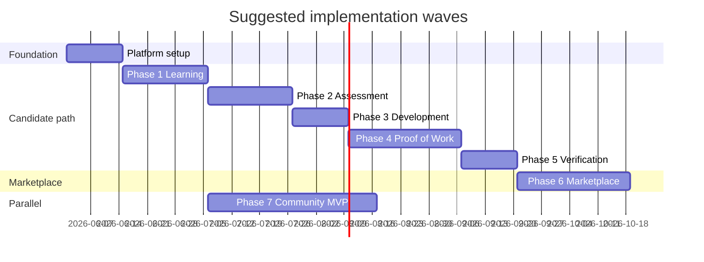

# ProductPath — Phasewise Implementation Plan

Implementation plan aligned with [phasewise architecture](./phasewiseArchitecture.md), [problem statement](./problemStatenment.md), and [edge cases](./edgeCases.md).

## Executive summary

| Item | Recommendation |
|------|----------------|
| **Build order** | Foundation → Phases 1–5 (candidate value chain) → Phase 6 (marketplace) → Phase 7 (community, parallelizable after Phase 1) |
| **First shippable milestone** | End of Phase 2: signup, role, learning, assessment, gap report |
| **MVP launch milestone** | End of Phase 6: verified candidates discoverable by verified recruiters |
| **Community** | Thin slice in MVP; deepen after marketplace is stable |



*Adjust durations to team size; bars are relative sequencing, not commitments.*

---

## Platform architecture (frontend & backend)

Canonical detail: [phasewise architecture — platform architecture](./phasewiseArchitecture.md#platform-architecture).

| App / package | Type | Port (local) | Role |
|---------------|------|--------------|------|
| `apps/api` | **Backend** | 4000 | REST API, auth, business logic, Prisma |
| `apps/web` | **Frontend** | 3000 | Candidate Next.js app |
| `apps/admin` | **Frontend** | 3001 | Admin / content / moderation console |
| `packages/database` | Shared | — | Prisma schema, migrations, seed |
| `packages/shared` | Shared | — | Zod schemas, constants (used by API + frontends) |
| `packages/ui` | Shared | — | React design system (frontends only) |

**How each phase is delivered**

1. **Backend first** — Prisma models, services, REST routes, tests in `apps/api`
2. **Candidate UI** — pages and API client in `apps/web`
3. **Admin UI** — content/review tools in `apps/admin` where applicable
4. **Contract** — add or extend Zod schemas in `packages/shared` when shapes are shared

**Do not:** call the database from Next.js, put business rules only in the client, or bypass API auth for admin actions.

---

## Prerequisites (locked for MVP)

These policies are **decided** for implementation. They resolve the former [open product decisions](./edgeCases.md#resolved-product-decisions) in `edgeCases.md`. Encode them in config (`VerificationPolicy`, feature flags) — do not leave as runtime ambiguity.

### Summary

| ID | Policy | MVP decision |
|----|--------|--------------|
| D-01 | Role change | Allowed anytime; prior role progress archived; only **active role** counts for assessment, projects, verification |
| D-02 | Assessment score for verification | **Latest passing** attempt within freshness window |
| D-03 | Assessment freshness | **180 days**; after expiry, downgrade verification state until reassessment passes |
| D-04 | Assessment retakes | **Max 3 attempts** per assessment version; **7-day cooldown** after a failed or completed attempt |
| D-05 | Pre-assessment learning gate | **Warn** if under 50% roadmap complete; **block** start if under 25% (configurable per role) |
| D-06 | Interest after verification lapse | Block **new** recruiter interest; **honor** already-accepted connections and revealed contact |
| D-07 | Threshold retroactivity | **Grandfather** users verified at time of change; others get **30-day grace** + email before downgrade |
| D-08 | Marketplace discovery gate | **`interview_ready`** only (not `verified_professional` alone) |
| D-09 | Interview ready requirements | Passing assessment (≥ **70%** overall, no skill below **50%**) **+** ≥ **1** approved project for **active role** |
| D-10 | Verified product professional | `interview_ready` **+** second approved project **or** overall ≥ **85%** (post-MVP badge tier; not required for marketplace) |
| D-11 | Emerging talent | ≥ **1** completed module **or** one assessment attempt finished (pass or fail) |
| D-12 | Multi-role | **Single active role**; no parallel verification tracks in MVP |
| D-13 | Module completion | All **required** resources in checklist marked done (no time-based auto-complete) |
| D-14 | Project resubmission | **Max 3** versions per template; rejection requires ≥ **100** characters of feedback |

### D-01 — Role change

- User may switch role from settings; show modal: *progress for the current role will be archived*.
- On switch: set `UserRoleSelection.active_role`; set previous row `archived_at`; do **not** delete `UserModuleProgress` or assessment history.
- New role gets fresh roadmap progress; prior role data remains viewable read-only in profile history.
- Assessments, gap analysis, project templates, and verification evaluate **only** `active_role`.

### D-02 — D-05 — Assessment

- **Verification uses:** the most recent attempt where `passed = true` and `completed_at` is within D-03 window.
- If user passes again after expiry, replace stale result for verification; re-run verification evaluator (Phase 5).
- Retakes: count only submitted attempts; `in_progress` abandoned attempts after 24h count as consumed (edge case P2-04).
- Hub UI shows cooldown end date and attempts remaining.

### D-06 — Verification lapse & recruiter interest

- When state drops below `interview_ready`: remove from discovery index within **1 hour** (job).
- Pending interests → `expired`; recruiter notified.
- Accepted connections unchanged; contact fields remain visible to both parties.

### D-07 — Policy changes

- Store `VerificationPolicy.version` on each `VerificationRecord`.
- On threshold increase: users with `granted_at` under old policy keep state until `expires_at` or grace end.
- Email template: reassessment required by `{grace_end_date}`.

### D-08 — D-10 — Verification states

| State | Entry rule |
|-------|------------|
| `learning` | Default after signup + role selected |
| `emerging_talent` | D-11 satisfied |
| `interview_ready` | D-09 satisfied; assessment fresh (D-03) |
| `verified_professional` | D-10 satisfied; assessment fresh (D-03) |

**Marketplace (Phase 6):** search and profile view require `interview_ready` **and** `discoverable = true`.

### D-12 — Multi-role

- One `active_role_id` per candidate; switching follows D-01.
- Defer multi-role dashboards and per-role verification badges to post-MVP.

### Config defaults (seed in Wave 0)

```yaml
verification:
  overall_pass_threshold: 70
  skill_floor_threshold: 50
  assessment_freshness_days: 180
  grace_period_days: 30
assessment:
  max_attempts_per_version: 3
  cooldown_days: 7
  abandon_attempt_hours: 24
learning:
  assessment_warn_progress_pct: 50
  assessment_block_progress_pct: 25
projects:
  max_submission_versions: 3
  min_rejection_feedback_chars: 100
```

---

## Wave 0: Foundation (all phases) ✅

**Docs:** [docs/phase0/](./phase0/README.md)

**Goal:** Shared platform every phase depends on — **separate backend API + two frontend apps**.

### Backend (`apps/api`) — implemented

| Area | Deliverable |
|------|-------------|
| Server | Express 5, `createApp()`, middleware stack |
| Data | Prisma + PostgreSQL; migrations in `packages/database` |
| Auth | `POST /auth/signup`, `login`, `logout`, `verify-email`, `resend-verification`, `GET /auth/me` |
| Session | httpOnly cookie `pp_session`, `Session` model |
| Admin API | `GET /admin/dashboard`, `/audit-logs`, `/feature-flags`, `PATCH /feature-flags/:key` |
| Public | `GET /roles`, `GET /health`, `GET /feature-flags` |
| Privacy stubs | `GET /privacy/export`, `POST /privacy/delete-request` |
| Security | Helmet, CORS, rate limits, Zod validation, audit log |
| Stubs | `lib/storage.ts`, `lib/jobs.ts` for Phase 4+ |

### Frontend — candidate (`apps/web`) — implemented

| Route | Feature |
|-------|---------|
| `/` | Landing |
| `/signup`, `/login` | Auth forms → API |
| `/verify-email`, `/verify-email/pending` | Email verification |
| `/dashboard` | Session gate, roles list, logout |
| `src/lib/api.ts` | Typed fetch client, `credentials: 'include'` |

### Frontend — admin (`apps/admin`) — implemented

| Route | Feature |
|-------|---------|
| `/login` | Admin-only login (rejects non-`ADMIN`) |
| `/dashboard` | Stats, audit logs, feature flags |

### Shared packages — implemented

| Package | Deliverable |
|---------|-------------|
| `packages/ui` | Button, Input, Card, Alert, PageLayout, EmptyState, Spinner |
| `packages/shared` | Auth Zod schemas, `SESSION_COOKIE`, rate limits, `sanitizeText` |
| `packages/database` | Schema, seed (5 roles, verification config, admin user) |

### Infrastructure

- Monorepo: pnpm workspaces + Turborepo
- `docker-compose.yml`: Postgres, Redis
- CI: `.github/workflows/ci.yml` (migrate, seed, test, build)
- Environments: `.env.example` → `local`; staging/production via env vars

### Core entities (initial)

```
User
CandidateProfile
RecruiterProfile (stub until Phase 6)
Role (PM, Design, Analytics, Marketing, Operations)
AuditLog
```

### Cross-cutting tasks

| Task | Notes | Edge cases |
|------|-------|------------|
| UTC timestamps everywhere | Server-side clocks for timers | X-14 |
| Rate limiting middleware | Auth, API, interest sends | X-04, P1-04, P6-14 |
| Input validation & sanitization | Max lengths, HTML escape | X-12, X-13 |
| Email verification flow | Signup, change email | X-01, X-02 |
| Feature flags | Phase rollout, kill switches | — |
| Privacy & delete/export hooks | Stub endpoints early | X-09 |

### Exit criteria

- [x] Candidate can sign up, verify email, log in, log out (`apps/web` + `apps/api`)
- [x] Admin can log in to admin console (`apps/admin` + `ADMIN` RBAC)
- [x] CI pipeline: migrate, seed, test, build (`.github/workflows/ci.yml`)

**Implemented:** see [README.md](../README.md) and [phase0 setup](./phase0/README.md#local-setup) (`pnpm install`, `docker compose up`, `pnpm db:migrate`, `pnpm db:seed`, `pnpm dev`).

**Estimated effort:** 2–3 weeks (small team)

---

## Phase 1: Learning foundation ✅

**Architecture reference:** Phase 1 in [phasewiseArchitecture.md](./phasewiseArchitecture.md)

**Depends on:** Wave 0

**Docs:** [docs/phase1/](./phase1/README.md)

**Implemented:** migration `20250602120000_phase1_learning`, PM roadmap seed, API + web + admin content views.

### Scope

| In scope | Out of scope (MVP) |
|----------|-------------------|
| Candidate auth & onboarding | Recruiter onboarding |
| Role selection (5 roles) | Multi-role parallel tracks |
| Roadmaps, modules, resources | AI-curated paths |
| Progress tracking | Certificates / LinkedIn export |

### Data model additions

```
Roadmap (role_id, version)
Module (roadmap_id, order, prerequisites[])
Resource (module_id, type, url|file, required)
UserModuleProgress (user_id, module_id, status, completed_at)
UserRoleSelection (user_id, role_id, active, switched_at)
```

### Backend (`apps/api`)

| Method | Endpoint | Purpose |
|--------|----------|---------|
| POST | `/candidates/me/role` | Select / switch role |
| GET | `/candidates/me/roadmap` | Roadmap for active role |
| GET | `/modules/:id` | Module detail + resources |
| POST | `/modules/:id/complete` | Mark complete (with rules) |
| GET | `/candidates/me/progress` | Aggregate progress |
| GET/POST/PATCH | `/admin/content/roadmaps`, `modules`, `resources` | Content CRUD |

**Services:** `roadmap.service.ts`, `progress.service.ts` — prerequisite checks, **D-01** role switch, **D-13** completion.

### Frontend — `apps/web`

| Route | Screen |
|-------|--------|
| `/onboarding/role` | Role selection + switch warning (**D-01**) |
| `/learn` | Roadmap overview, progress % (not “interview ready”) |
| `/learn/[moduleId]` | Resources, checklist, mark complete |
| `/settings/role` | Change role (archive warning) |

Extend `src/lib/api.ts` with roadmap/progress methods.

### Frontend — `apps/admin`

| Route | Screen |
|-------|--------|
| `/content/roadmaps` | List / edit roadmaps per role |
| `/content/modules/[id]` | Module + resource editor |

### Implementation tasks

| # | Layer | Task | Priority |
|---|-------|------|----------|
| 1.1 | BE | Prisma models + seed PM roadmap (modules, resources) | P0 |
| 1.2 | BE | `POST /candidates/me/role` + **D-12** active role | P0 |
| 1.3 | BE | Roadmap/progress APIs + prerequisite checks | P0 |
| 1.4 | FE web | `/onboarding/role`, `/learn`, module viewer | P0 |
| 1.5 | FE web | Resource renderer (link, PDF, video) | P0 |
| 1.6 | BE+FE | Completion rules **D-13**; progress copy **P1-13** | P1 |
| 1.7 | FE web | Role switch modal + **D-01** | P0 |
| 1.8 | FE admin | Content CRUD pages | P1 |

### Acceptance criteria

- [x] New candidate selects a role and sees a role-specific roadmap  
- [x] Completing required resources marks module complete; progress updates  
- [x] Switching role shows warning; prior progress archived per policy  
- [x] UI never claims “interview ready” from learning progress alone  

### P0 edge cases to implement

P1-06, P1-13, P1-18, P1-05 (prompt if no role)

### Exit criteria → Phase 2

- [ ] At least one full roadmap seeded for **Product Management** (pilot role)  
- [ ] Progress API stable and used by frontend  

**Estimated effort:** 3 weeks

---

## Phase 2: Skill assessment ✅

**Depends on:** Phase 1 (active role); enforce learning gate **D-05**

**Docs:** [docs/phase2/](./phase2/README.md)

### Scope

| In scope | Out of scope |
|----------|--------------|
| Assessment hub, timed attempts | AI question generation |
| Question bank (admin-managed) | Adaptive testing |
| Scoring, skill breakdown, gaps | Proctoring / webcam |
| Assessment history | — |

### Data model additions

```
Skill (common | role_specific, role_id?)
Question (skill_id, type, content, options, correct_answer, version)
Assessment (role_id, skills[], passing_threshold)
AssessmentAttempt (user_id, assessment_id, status, started_at, expires_at)
AttemptAnswer (attempt_id, question_id, answer)
AssessmentResult (attempt_id, scores_by_skill, overall, passed)
```

### Backend (`apps/api`)

| Method | Endpoint | Purpose |
|--------|----------|---------|
| GET | `/assessments/hub` | Available assessments for role |
| POST | `/assessments/:id/attempts` | Start attempt (enforce **D-05** gate) |
| GET | `/attempts/:id` | Resume (server timer, current question) |
| PUT | `/attempts/:id/answers` | Autosave answer |
| POST | `/attempts/:id/submit` | Finalize & score |
| GET | `/candidates/me/assessments/results` | History + latest |
| GET | `/candidates/me/gaps` | Gap analysis |

**Services:** `assessment.service.ts`, `scoring.service.ts` — timer, retakes **D-04**, scoring **D-02**.

### Frontend — `apps/web`

| Route | Screen |
|-------|--------|
| `/assessments` | Hub, retake cooldown, learning gate warnings |
| `/assessments/[attemptId]` | Timed question flow, autosave |
| `/assessments/results/[id]` | Skill breakdown, link to gaps |

### Frontend — `apps/admin`

| Route | Screen |
|-------|--------|
| `/content/questions` | Question bank CRUD |
| `/content/assessments` | Per-role assessment config |

### Implementation tasks

| # | Layer | Task | Priority |
|---|-------|------|----------|
| 2.1 | FE admin | Question bank UI | P0 |
| 2.2 | BE | Assessment config per role | P0 |
| 2.3 | BE | Server timer + attempt state machine | P0 |
| 2.4 | BE+FE | Autosave + resume (**P2-05**) | P0 |
| 2.5 | BE | Submit & score + version on result | P0 |
| 2.6 | BE+FE | Retake policy **D-04** surfaced in UI | P0 |
| 2.7 | BE | Gap analysis vs **D-09** | P0 |
| 2.8 | BE | Wire latest pass to verification prep | P0 |

### Acceptance criteria

- [x] Candidate completes timed assessment; timer enforced server-side  
- [x] Results show per-skill scores and gaps  
- [x] Retake blocked during cooldown; clear next attempt date  
- [x] Refresh mid-attempt restores state without resetting timer  

### P0 edge cases

P2-04, P2-05, P2-07, P2-08, P2-11, P2-14, P2-15, P2-16, X-08, X-14

### Exit criteria → Phase 3

- [ ] PM role assessment live with ≥20 questions across common + role skills  
- [ ] Gap API consumed by frontend  

**Estimated effort:** 3 weeks

---

## Phase 3: Skill development ✅

**Depends on:** Phase 2 (gap analysis)

**Docs:** [docs/phase3/](./phase3/README.md)

### Scope

Thin phase: mostly **orchestration** over Phase 1 learning assets.

### Data model additions

```
LearningRecommendation (user_id, skill_id, module_ids[], source_attempt_id)
SkillDevelopmentSnapshot (user_id, skill_id, status, updated_at)
```

### Backend (`apps/api`)

| Method | Endpoint | Purpose |
|--------|----------|---------|
| GET | `/candidates/me/recommendations` | Modules from gaps |
| POST | `/candidates/me/recommendations/refresh` | After new assessment |
| GET | `/candidates/me/skill-development` | Progress vs gaps |

### Frontend — `apps/web`

| Route | Screen |
|-------|--------|
| `/gaps` | Gap list, recommended modules, CTA to `/learn/...` |
| `/dashboard` | Widget: skill development summary |

### Implementation tasks

| # | Layer | Task | Priority |
|---|-------|------|----------|
| 3.1 | BE+admin | Skill → module mapping config | P0 |
| 3.2 | BE | Generate on assessment complete | P0 |
| 3.3 | BE | Refresh on retake | P0 |
| 3.4 | FE web | Dashboard widget | P1 |
| 3.5 | FE web | Skip-to-projects banner **P3-03** | P0 |

### Acceptance criteria

- [x] After assessment, user sees module recommendations per gap  
- [x] Completing modules does not auto-close gaps without retake  
- [x] User can navigate to project hub with explicit warning if gaps remain  

### P0 edge cases

P3-01, P3-02, P3-03, P3-06, P3-07

### Exit criteria → Phase 4

- [x] Recommendation pipeline tested end-to-end for PM role  

**Estimated effort:** 2 weeks

---

## Phase 4: Proof of work ✅

**Depends on:** Phase 1 (role), Phase 2 optional (gating message only)

**Docs:** [docs/phase4/](./phase4/README.md)

### Scope

| In scope | Out of scope |
|----------|--------------|
| Project templates per role | AI review |
| Submissions (file + URL) | Peer review |
| Reviewer queue & rubric | — |
| Feedback & resubmission | — |

### Data model additions

```
ProjectTemplate (role_id, slug, instructions, rubric)
ProjectSubmission (user_id, template_id, status, version, artifacts[])
SubmissionReview (submission_id, reviewer_id, decision, feedback, rubric_scores)
ReviewerProfile (user_id, roles[])
```

**Submission status:** `draft` → `submitted` → `under_review` → `approved` | `rejected` → `resubmitted`

### Backend (`apps/api`)

| Method | Endpoint | Purpose |
|--------|----------|---------|
| GET | `/projects/templates` | By active role |
| POST | `/projects/submissions` | Create draft |
| PUT | `/projects/submissions/:id` | Update draft |
| POST | `/projects/submissions/:id/submit` | Lock & queue review |
| POST | `/projects/submissions/:id/upload` | Multipart → `lib/storage.ts` |
| GET | `/candidates/me/submissions` | List mine |
| GET | `/reviewer/queue` | Reviewer inbox (`REVIEWER` or `ADMIN`) |
| POST | `/reviews` | Approve / reject with feedback |

**Services:** `project.service.ts`, `review.service.ts` — implement `putObject` for S3/local.

### Frontend — `apps/web`

| Route | Screen |
|-------|--------|
| `/projects` | Hub, template cards |
| `/projects/[templateSlug]` | Instructions, editor, file/URL upload |
| `/projects/submissions/[id]` | Status, feedback, resubmit |

### Frontend — `apps/admin`

| Route | Screen |
|-------|--------|
| `/reviews` | Review queue + rubric form |
| `/content/project-templates` | Template CRUD |

### Implementation tasks

| # | Layer | Task | Priority |
|---|-------|------|----------|
| 4.1 | BE | Seed PM templates | P0 |
| 4.2 | BE | Upload validation + storage adapter | P0 |
| 4.3 | BE | Draft / submit / lock workflow | P0 |
| 4.4 | BE+admin | Reviewer queue API + UI | P0 |
| 4.5 | BE+admin | Rubric-required approve/reject | P0 |
| 4.6 | BE+FE | Resubmission **D-14** | P0 |
| 4.7 | BE+admin | Approval reversal + audit | P0 |
| 4.8 | BE | Virus scan on upload | P0 |
| 4.9 | FE web | Project hub + submission flows | P0 |

### Acceptance criteria

- [x] Candidate submits PM teardown (or PRD); enters review queue  
- [x] Reviewer approves with rubric; candidate sees badge on submission  
- [x] Rejection requires feedback; resubmit creates v2  
- [x] Submission locked while `under_review`  

### P0 edge cases

P4-01, P4-02, P4-05, P4-07, P4-09, P4-12, P4-13, P4-15, S-05, S-06

### Exit criteria → Phase 5

- [ ] Manual review SLA process documented; ≥2 reviewers trained  
- [ ] At least one approved submission possible in staging  

**Estimated effort:** 4 weeks

---

## Phase 5: Verification ✅

**Depends on:** Phase 2 (assessment results), Phase 4 (approved project)

**Docs:** [docs/phase5/](./phase5/README.md)

### Scope

Verification engine, badges, expiry, state machine for candidate trust layer.

### Data model additions

```
VerificationRecord (user_id, state, assessment_result_id, submission_id, granted_at, expires_at)
VerificationPolicy (thresholds, freshness_days, version)
FreshnessCheck (user_id, type, due_at, completed_at)
```

### State machine

```
learning → emerging_talent → interview_ready → verified_professional
                ↑                    ↓
         (partial milestones)   (expiry / failed refresh)
```

**MVP gate for Phase 6:** implement **D-08** and **D-09** (`interview_ready` = fresh passing assessment + ≥1 approved project for active role).

### Backend (`apps/api`)

| Method | Endpoint | Purpose |
|--------|----------|---------|
| GET | `/candidates/me/verification` | State, requirements checklist |
| POST | `/internal/verification/evaluate` | Called after assessment / project events |
| GET | `/candidates/:id/public` | Public profile + badge metadata |

**Jobs:** `lib/jobs.ts` — `verification.expire` worker (Redis); wire in Phase 5.

### Frontend — `apps/web`

| Route | Screen |
|-------|--------|
| `/profile` | Verification checklist, badge, `valid until` |
| `/dashboard` | Re-verification banner when expiring |

Shared: `VerificationBadge` in `packages/ui` (optional).

### Implementation tasks

| # | Layer | Task | Priority |
|---|-------|------|----------|
| 5.1 | BE | `verification.service.ts` + policy from seed | P0 |
| 5.2 | BE | Evaluate hooks on assessment / approval | P0 |
| 5.3 | BE | State machine **D-11**, **D-10** | P1 |
| 5.4 | BE | Expiry job **D-03**, **D-06** | P0 |
| 5.5 | FE web | Checklist + badge UI | P0 |
| 5.6 | BE | Middleware: marketplace gate **D-08** | P0 |

### Acceptance criteria

- [x] User with passing assessment + approved project → `interview_ready`  
- [x] User with only one requirement met stays below interview ready  
- [x] Expired assessment downgrades state and hides from discovery (Phase 6 hook)  
- [x] Checklist UI accurate in real time  

### P0 edge cases

P5-01, P5-02, P5-03, P5-04, P5-06, P5-08, P5-10

### Exit criteria → Phase 6

- [ ] Verification state machine tested with expiry job  
- [ ] Public candidate profile shows trustworthy badge data  

**Estimated effort:** 2 weeks

---

## Phase 6: Talent marketplace ✅

**Depends on:** Phase 5 (**D-08** `interview_ready` gate, **D-06** on lapse)

**Docs:** [docs/phase6/](./phase6/README.md)

### Scope

| In scope | Out of scope |
|----------|--------------|
| Recruiter signup & verification | Org / team seats |
| Candidate discovery & filters | Advanced analytics |
| Interest request flow | In-app messaging |
| Contact unlock on accept | Referrals |

### Data model additions

```
RecruiterProfile (user_id, company, verified, domain)
CandidateDiscoverySettings (user_id, discoverable, role_id)
InterestRequest (recruiter_id, candidate_id, status, message)
Connection (interest_request_id, contact_revealed_at)
Opportunity (recruiter_id, title, description, status) — optional MVP list
```

**Interest status:** `pending` → `accepted` | `declined` | `expired`

### Backend (`apps/api`)

| Method | Endpoint | Purpose |
|--------|----------|---------|
| POST | `/recruiters/signup` | Recruiter registration |
| POST | `/recruiters/verify` | Domain / manual verification |
| GET | `/recruiters/talent` | Search (`interview_ready` + discoverable only) |
| GET | `/recruiters/candidates/:id` | Profile + evidence |
| POST | `/interest-requests` | Send interest (rate limited) |
| PATCH | `/interest-requests/:id` | Accept / decline |
| GET | `/candidates/me/interests` | Candidate inbox |
| PATCH | `/candidates/me/discovery` | Opt in/out |

**Jobs:** interest expiry cron; optional search index table or materialized view.

### Frontend — `apps/web`

| Route | Audience | Screen |
|-------|----------|--------|
| `/settings/discovery` | Candidate | Discoverability toggle |
| `/opportunities` | Candidate | Interest inbox, accept/decline |
| `/recruiter/onboarding` | Recruiter | Signup + verification pending |
| `/recruiter/search` | Recruiter | Talent search + filters |
| `/recruiter/candidates/[id]` | Recruiter | Profile + send interest |

*MVP uses role-gated routes on `apps/web`; split to `apps/recruiter` later if needed.*

### Frontend — `apps/admin`

| Route | Screen |
|-------|--------|
| `/recruiters` | Verification queue |
| `/users/candidates` | Discovery / verification overrides (audited) |

### Implementation tasks

| # | Layer | Task | Priority |
|---|-------|------|----------|
| 6.1 | BE+admin | Recruiter signup + verification queue | P0 |
| 6.2 | BE | Search API + discovery index | P0 |
| 6.3 | BE+FE | Filters (role, skills, freshness) | P1 |
| 6.4 | BE+FE | Interest flow + rate limits | P0 |
| 6.5 | BE+FE | Accept/decline + contact reveal | P0 |
| 6.6 | BE | Expire pending interests (job) | P0 |
| 6.7 | FE web | Discovery settings | P0 |
| 6.8 | FE web | Recruiter search & profile views | P0 |

### Acceptance criteria

- [x] Unverified recruiter cannot search  
- [x] Unverified / non-discoverable candidates never appear in search  
- [x] Interest → accept → both parties see agreed contact info  
- [x] Declined / expired requests do not leak contact  
- [x] Verified candidate who lapses removed from search on next evaluation/expiry job  

### P0 edge cases

P6-01, P6-02, P6-06, P6-07, P6-10, P6-12, P6-14, P6-16, P6-17, L-03, L-06, S-04

### Exit criteria → MVP launch

- [ ] End-to-end demo: candidate verifies → recruiter finds → interest → hire connection  
- [ ] Security review on search & IDOR paths  

**Estimated effort:** 4 weeks

---

## Phase 7: Community ✅

**Depends on:** Phase 1 (auth); soft dependency on Phase 4 for project sharing labels

**Docs:** [docs/phase7/](./phase7/README.md)

**Note:** Can start a **thin MVP** after Phase 1 (feed only) and harden through launch.

### Scope (MVP)

Posts, comments, likes; report flow; basic moderation queue.

### Data model additions

```
Post (author_id, type, body, visibility)
Comment (post_id, author_id, body, parent_id?)
Like (user_id, post_id)
Report (target_type, target_id, reason)
ModerationAction (report_id, action, moderator_id)
```

### Backend (`apps/api`)

| Method | Endpoint | Purpose |
|--------|----------|---------|
| GET | `/feed` | Paginated feed |
| POST | `/posts` | Create post |
| POST | `/posts/:id/comments` | Comment |
| POST | `/posts/:id/like` | Toggle like |
| POST | `/reports` | Report content |
| GET/PATCH | `/admin/moderation/*` | Mod queue actions |

Use `sanitizeText` from `packages/shared` on write; escape on read.

### Frontend — `apps/web`

| Route | Screen |
|-------|--------|
| `/community` | Feed, compose, infinite scroll |
| `/community/posts/[id]` | Thread, comments, like, report |

### Frontend — `apps/admin`

| Route | Screen |
|-------|--------|
| `/moderation` | Report queue, hide/remove actions |

### Implementation tasks

| # | Layer | Task | Priority |
|---|-------|------|----------|
| 7.1 | BE+FE web | Feed + post CRUD | P0 |
| 7.2 | BE+FE web | Comments (max depth 2) | P1 |
| 7.3 | BE+FE web | Likes + rate limits | P1 |
| 7.4 | BE+FE admin | Report + moderation queue | P0 |
| 7.5 | FE web | Verified vs unverified project labels | P0 |
| 7.6 | BE+shared | Sanitize / escape user content | P0 |

### Acceptance criteria

- [x] Authenticated users can post, comment, like  
- [x] Reported content enters mod queue; admin can hide post  
- [x] Unverified work not labeled as verified  

### P0 edge cases

P7-01, P7-05, P7-10, X-13

### Exit criteria

- [ ] Community live for beta users with moderation playbook  

**Estimated effort:** 3 weeks (overlap with Phases 4–6)

---

## Testing & quality gates (every phase)

| Gate | Backend (`apps/api`) | Frontend (`apps/web`, `apps/admin`) |
|------|----------------------|-------------------------------------|
| **Unit** | Services, scoring, state machines (Vitest) | Form validation, UI components (`packages/ui`) |
| **Integration** | Supertest against `createApp()` + test DB | API client mocks optional |
| **E2E** | — | Playwright: auth → phase happy path per app |
| **Edge cases** | P0 IDs — API behavior | P0 IDs — UI states, error messages |
| **UAT** | Postman/contract check | Product walkthrough on staging URLs |

Contract: when API shapes change, update `packages/shared` Zod schemas and both `src/lib/api.ts` clients.

---

## Content & operations (parallel track)

| Workstream | Owner | When |
|------------|-------|------|
| PM roadmap + modules | Content / PM | Before Phase 1 exit |
| Question bank (PM) | Domain expert | Before Phase 2 exit |
| Project templates + rubrics | Domain expert | Before Phase 4 |
| Reviewer hiring & SLA | Operations | Phase 4 start |
| Recruiter pilot partners | BD | Phase 6 start |
| Community guidelines | Trust & Safety | Phase 7 start |

---

## Suggested team allocation

| Role | Owns | Phases |
|------|------|--------|
| **Backend engineer** | `apps/api`, `packages/database`, jobs | 0–7 APIs, business rules |
| **Frontend engineer** | `apps/web`, `packages/ui`, `packages/shared` (with BE) | 1–7 candidate UX |
| **Admin / internal tools** | `apps/admin` | 1, 2, 4, 6, 7 content & moderation |
| **QA** | E2E across web + admin + API contracts | P0 edge cases per phase |
| **Product / content** | Seeds, copy, rubrics | Roadmaps, assessments, projects |

---

## MVP launch checklist

- [ ] Wave 0 complete; staging stable  
- [ ] Phases 1–5 functional for **Product Management** pilot role  
- [ ] Phase 6 recruiter verification + search + interest flow  
- [ ] Phase 7 feed + moderation minimum  
- [ ] All P0 edge cases for Phases 1–6 traced in test plan  
- [ ] Legal: privacy policy, terms, data deletion process  
- [ ] Runbooks: review SLA, verification expiry, incident response  

---

## Related documents

| Document | Use |
|----------|-----|
| [phasewiseArchitecture.md](./phasewiseArchitecture.md) | What to build |
| [edgeCases.md](./edgeCases.md) | Test scenarios & policies |
| [problemStatenment.md](./problemStatenment.md) | Why & principles |

---

## Document history

| Version | Date | Notes |
|---------|------|-------|
| 1.0 | 2026-06-02 | Initial phasewise implementation plan |
