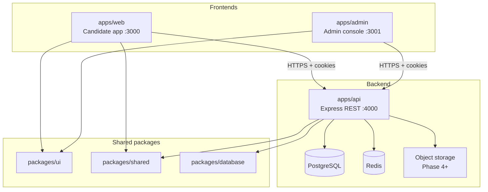
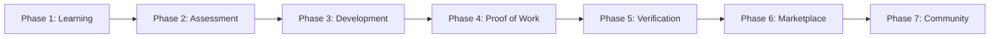

# ProductPath — Phasewise Architecture

This document describes how ProductPath is built in phases—from learning foundations through verification and marketplace—aligned with the [problem statement](./problemStatenment.md).

For build tasks and exit criteria, see the [implementation plan](./implementationPlan.md).

---

## Platform architecture

ProductPath uses a **separate backend API** and **multiple frontend applications** in a pnpm monorepo. Business logic, persistence, and authorization live on the backend; frontends are thin clients that call the REST API.



### Design principles

| Principle | Description |
|-----------|-------------|
| **API-first** | All product behavior exposed via versioned REST endpoints under `apps/api`; no direct DB access from frontends |
| **Thin clients** | Next.js apps handle routing, forms, and UI state; validation duplicated with Zod in `packages/shared` |
| **Single source of truth** | PostgreSQL via Prisma; server-side timers and scoring (assessments, verification) |
| **Role-based surfaces** | Candidate UX in `web`, operations/content in `admin`, shared auth via same API session cookie |
| **Progressive phases** | Feature flags gate phase rollout; same repo, incremental API + UI per phase |

---

## Backend (`apps/api`)

| Layer | Technology | Responsibility |
|-------|------------|----------------|
| **Runtime** | Node.js 20+, Express 5 | HTTP server, middleware, routing |
| **Data** | Prisma 6, PostgreSQL | Entities, migrations, transactions |
| **Auth** | bcrypt, httpOnly session cookie (`pp_session`) | Signup, login, email verify, RBAC |
| **Validation** | Zod (`packages/shared`) | Request body/query schemas |
| **Cross-cutting** | Helmet, CORS, rate-limit, Pino | Security, observability |
| **Jobs** | Redis + worker (Phase 5+) | Verification expiry, interest expiry, email |
| **Files** | S3-compatible storage (Phase 4+) | Project submissions |

### API conventions

- **Base URL:** `http://localhost:4000` (local); `NEXT_PUBLIC_API_URL` in frontends
- **Auth:** Session cookie set by `POST /auth/login` and `POST /auth/verify-email`; sent with `credentials: 'include'`
- **Errors:** JSON `{ error, code?, details? }` with appropriate HTTP status
- **Namespaces:**
  - `/auth/*` — authentication (public + session)
  - `/roles`, `/candidates/*` — candidate domain
  - `/assessments/*`, `/attempts/*` — Phase 2
  - `/projects/*`, `/reviews/*` — Phase 4
  - `/recruiters/*`, `/interest-requests/*` — Phase 6
  - `/feed/*`, `/posts/*` — Phase 7
  - `/admin/*` — admin-only (requires `ADMIN` role)
  - `/privacy/*` — GDPR stubs
  - `/health`, `/metrics` — ops

### Backend ownership by phase

| Phase | Primary API areas | New services / jobs |
|-------|-------------------|---------------------|
| 0 ✅ | `/auth`, `/roles`, `/admin`, `/privacy`, `/feature-flags` | Session, audit, seed config |
| 1 ✅ | `/candidates/me/roadmap`, `/modules`, progress | Roadmap CRUD (admin) |
| 2 ✅ | `/assessments`, `/attempts`, scoring, gaps | Server timer, attempt state machine |
| 3 ✅ | `/candidates/me/recommendations` | Gap → module mapping |
| 4 ✅ | `/projects`, `/reviews`, uploads | Review queue, storage adapter |
| 5 ✅ | `/candidates/me/verification` | Verification evaluator, expiry cron |
| 6 | `/recruiters`, search, interests | Discovery index, rate limits |
| 7 | `/feed`, `/posts`, `/reports` | Moderation queue |

---

## Frontend

Two Next.js 15 applications share `packages/ui` and call the same API. They do **not** share routes or layouts.

### Candidate app — `apps/web` (port 3000)

| Concern | Approach |
|---------|----------|
| **Framework** | Next.js App Router, React 19 |
| **Styling** | CSS variables via `@productpath/ui` (+ optional Tailwind later) |
| **Data fetching** | Client components + `src/lib/api.ts` (fetch to backend) |
| **Auth UX** | Signup, login, verify-email, dashboard; session via API cookie |
| **Audience** | Candidates (default `CANDIDATE` role) |

**Route map (current + planned)**

| Route | Phase | Purpose |
|-------|-------|---------|
| `/` | 0 ✅ | Landing |
| `/signup`, `/login` | 0 ✅ | Auth |
| `/verify-email`, `/verify-email/pending` | 0 ✅ | Email verification |
| `/dashboard` | 0 ✅ | Home / progress hub |
| `/onboarding/role` | 1 ✅ | Role selection |
| `/learn`, `/learn/[moduleId]` | 1 ✅ | Roadmap & modules |
| `/assessments`, `/assessments/[attemptId]` | 2 ✅ | Assessment flow |
| `/assessments/gaps` | 2 ✅ | Skill gaps from latest result |
| `/gaps` | 3 ✅ | Skill gaps & recommendations |
| `/projects`, `/projects/[templateSlug]` | 4 ✅ | Projects hub & start |
| `/projects/submissions/[id]` | 4 ✅ | Draft, submit, feedback, resubmit |
| `/profile` | 5 ✅ | Verification checklist, badge |
| `/opportunities` | 6 | Interest inbox (candidate) |
| `/community` | 7 | Feed |

### Admin console — `apps/admin` (port 3001)

| Concern | Approach |
|---------|----------|
| **Framework** | Next.js App Router, React 19 |
| **Auth** | Same API; login must be `platformRole: ADMIN` |
| **Audience** | Internal ops, reviewers (future `REVIEWER` routes) |

**Route map (current + planned)**

| Route | Phase | Purpose |
|-------|-------|---------|
| `/login`, `/dashboard` | 0 ✅ | Admin auth & stats |
| `/content/roadmaps` | 1 ✅ | Roadmap / module / resource CRUD (view) |
| `/content/questions` | 2 ✅ | Question bank |
| `/content/skill-mappings` | 3 ✅ | Skill → module mapping |
| `/content/project-templates` | 4 ✅ | Project template list |
| `/reviews` | 4 ✅ | Reviewer queue & rubric |
| `/reviews` | 4 | Project review queue |
| `/users`, `/recruiters` | 6 | Verification & recruiter approval |
| `/moderation` | 7 | Reported content |
| `/settings/flags` | 0 ✅ | Feature flags (API exists) |

### Shared frontend packages

| Package | Used by | Contents |
|---------|---------|----------|
| `packages/ui` | web, admin | Button, Input, Card, Alert, PageLayout, EmptyState |
| `packages/shared` | web, admin, api | Zod schemas, constants, `sanitizeText` |

### Frontend ↔ backend contract

1. Frontends never import `@productpath/database` (no Prisma in browser).
2. Shared Zod schemas validate forms on the client; API re-validates on the server.
3. Long-running or trusted operations (timers, scores, verification) run only on the backend.
4. Admin and web use separate origins in production; both listed in API `CORS_ORIGINS`.

---

## Monorepo layout

```
ProductPath/
├── apps/
│   ├── api/                 # Backend: Express REST API
│   ├── web/                 # Frontend: candidate Next.js app
│   └── admin/               # Frontend: admin Next.js app
├── packages/
│   ├── database/            # Prisma schema, migrations, seed
│   ├── shared/              # Types, Zod, constants (FE + BE)
│   └── ui/                  # React design system (FE only)
├── docs/
├── docker-compose.yml       # Postgres, Redis
└── .github/workflows/ci.yml
```

### Environments

| Env | API | Web | Admin | Database |
|-----|-----|-----|-------|----------|
| **local** | :4000 | :3000 | :3001 | Docker Postgres |
| **staging** | api.staging.* | app.staging.* | admin.staging.* | Managed Postgres |
| **production** | api.* | app.* | admin.* | Managed Postgres + Redis + S3 |

---

## Product flow (phases)



Community (Phase 7) runs alongside the journey; verification (Phase 5) gates access to the talent marketplace (Phase 6).

---

## Phase 0: Foundation (Wave 0)

**Objective:** Establish the monorepo, API, auth, admin console, and shared packages.

**Docs:** [phase0/README.md](./phase0/README.md)

| Layer | Components |
|-------|------------|
| **Backend** | Auth, sessions, roles list, admin dashboard, audit, feature flags, privacy stubs |
| **Frontend (web)** | Landing, signup/login, email verification, dashboard |
| **Frontend (admin)** | Admin login, stats, audit logs, feature flags |
| **Shared** | `packages/database`, `packages/shared`, `packages/ui`, Docker, CI |

---

## Phase 1: Learning Foundation

**Objective:** Help users understand product roles and build foundational skills.

**Docs:** [phase1/README.md](./phase1/README.md)

**User flow**

1. Sign up  
2. Select product role  
3. Open learning roadmap  
4. Complete modules  
5. Track progress  

**Components**

| Layer | Components |
|-------|------------|
| **Backend** | Role APIs, roadmap/module/resource models, progress service, admin content APIs |
| **Frontend (web)** | Onboarding, learning dashboard, module viewer, progress UI |
| **Admin** | Roadmap / module / resource CRUD |

**Supported roles**

- Product Management  
- Product Design  
- Product Analytics  
- Product Marketing  
- Product Operations  

---

## Phase 2: Skill Assessment

**Docs:** [phase2/README.md](./phase2/README.md)

**Objective:** Measure hiring readiness and surface skill gaps.

**User flow**

1. Assessment hub  
2. Readiness assessment  
3. Skill evaluation  
4. Results  
5. Recommended learning path  

**Components**

| Layer | Components |
|-------|------------|
| **Backend** | Assessment engine, question bank, server timer, scoring, gap analysis, history |
| **Frontend (web)** | Assessment hub, timed question UI, results & breakdown |
| **Admin** | Question bank CRUD, assessment config per role |

**Assessment areas**

| Category | Examples |
|----------|----------|
| **Common skills** | Problem solving, user thinking, communication, analytical thinking |
| **Role-specific skills** | Defined per selected product role |

---

## Phase 3: Skill Development

**Docs:** [phase3/README.md](./phase3/README.md)

**Objective:** Close gaps identified in assessment.

**User flow**

1. Assessment results  
2. Recommended modules  
3. Learning completion  
4. Project preparation  

**Components**

| Layer | Components |
|-------|------------|
| **Backend** | Recommendation engine (skill → modules), refresh on retake |
| **Frontend (web)** | Gaps dashboard, deep links to modules, skip warnings |

---

## Phase 4: Proof of Work

**Docs:** [phase4/README.md](./phase4/README.md)

**Objective:** Let candidates demonstrate practical capability beyond tests.

**User flow**

1. Projects hub  
2. Select project  
3. Submit work  
4. Review process  
5. Approval (or feedback for resubmission)  

**Components**

| Layer | Components |
|-------|------------|
| **Backend** | Templates, submissions, file storage, review workflow, feedback |
| **Frontend (web)** | Projects hub, submission editor, status & resubmit |
| **Admin** | Reviewer queue, rubric form, template management |

**Example projects by role**

| Role | Examples |
|------|----------|
| **Product Management** | Product teardown, PRD, feature proposal |
| **Product Design** | UX audit, design case study |
| **Product Analytics** | Dashboard analysis, product metrics project |

---

## Phase 5: Verification

**Docs:** [phase5/README.md](./phase5/README.md)

**Objective:** Establish trusted, portable proof of capability.

**Requirements**

Verification requires **both**:

- Assessment score at or above the defined threshold  
- At least one approved project submission  

**Verification states**

| State | Meaning |
|-------|---------|
| Learning | Building foundations; not yet market-ready |
| Emerging talent | Progressing; partial proof |
| Interview ready | Meets bar for recruiter discovery |
| Verified product professional | Full verification with active freshness |

**Components**

| Layer | Components |
|-------|------------|
| **Backend** | Verification engine, state machine, expiry jobs, public profile API |
| **Frontend (web)** | Checklist UI, badge, re-verification prompts |
| **Admin** | Policy config viewer, manual override (audited) |

---

## Phase 6: Talent Marketplace

**Objective:** Connect verified talent with hiring partners.

**Candidate flow**

1. Verification achieved  
2. Opportunity access  
3. Recruiter interest  
4. Connection (contact details after mutual acceptance)  

**Recruiter flow**

1. Search talent  
2. View profiles (skills, assessments, projects)  
3. Send interest  
4. Candidate accepts  
5. Contact details unlocked  

**Components**

| Layer | Components |
|-------|------------|
| **Backend** | Recruiter verification, search index, interest requests, contact unlock |
| **Frontend (web)** | Candidate discovery settings, interest inbox |
| **Frontend (recruiter)** | Search & profiles — *MVP: extend `web` or add `apps/recruiter` post-MVP* |
| **Admin** | Recruiter approval queue |

> **Note:** MVP recruiter flows can live on `apps/web` behind `RECRUITER` role routes (`/recruiter/*`) until traffic warrants a dedicated `apps/recruiter`.

---

## Phase 7: Community

**Objective:** Build a network for product professionals to learn and share signal.

**Components**

| Layer | Components |
|-------|------------|
| **Backend** | Posts, comments, likes, reports, moderation APIs |
| **Frontend (web)** | Feed, compose, thread view |
| **Admin** | Moderation queue |

**Features (initial)**

- Posts  
- Comments  
- Likes  

---

## Lifecycles

### Candidate lifecycle

```
Join ProductPath
  → Choose product role
  → Learn
  → Take assessment
  → Identify skill gaps
  → Improve skills
  → Submit projects
  → Earn verification
  → Access opportunities
  → Connect with recruiters
```

### Recruiter lifecycle

```
Join ProductPath
  → Recruiter verification
  → Search talent
  → Review profiles and projects
  → Send interest
  → Candidate acceptance
  → Connect and hire
```

---

## MVP Scope

### In scope

- Authentication  
- Role selection  
- Learning roadmaps and resource management  
- Assessments and results  
- Projects and reviews  
- Verification  
- Candidate and recruiter profiles  
- Candidate discovery and interest requests  
- Community (core feed features)  

### Out of scope (post-MVP)

- AI mentor  
- AI assessment generation  
- AI project review  
- Mock interviews  
- Resume builder  
- Referral system  
- Advanced analytics  

---

## Success Metric

ProductPath succeeds when recruiters can **confidently discover and engage** skilled product professionals without leaning on educational pedigree, and candidates can **earn opportunities through demonstrated capability** rather than credentials alone.

---

## Related documents

| Document | Description |
|----------|-------------|
| [Implementation plan](./implementationPlan.md) | Phasewise build order, backend/frontend tasks, APIs, exit criteria |
| [README](../README.md) | Local setup, ports, scripts |
| [Phase 0 docs](./phase0/README.md) | Foundation (Wave 0) documentation |
| [Phase 1 docs](./phase1/README.md) | Learning phase documentation |
| [Phase 2 docs](./phase2/README.md) | Assessment phase documentation |
| [Phase 3 docs](./phase3/README.md) | Skill development phase documentation |
| [Phase 4 docs](./phase4/README.md) | Proof of work phase documentation |
| [Phase 5 docs](./phase5/README.md) | Verification phase documentation |
| [Phase 6 docs](./phase6/README.md) | Talent marketplace documentation |
| [Phase 7 docs](./phase7/README.md) | Community feed documentation |
| [Edge cases](./edgeCases.md) | Scenarios, expected behavior, and test priorities |
| [Problem statement](./problemStatenment.md) | Vision and core principles |
